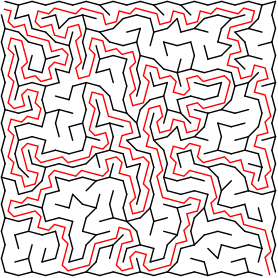
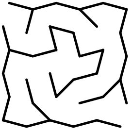

# SnubSquare shape maze generator

## Run the program using following arguments:
- ***--output="/file/path.svg"*** - _Output file path_
- ***--width=20*** - _Maze width_
- ***--height=20*** - _Maze height_
- ***--solution*** - _Show a solution_
- ***--zoom=1.5*** - _Zoom factor_




# API Usage

```java
int width = 20;
int height = 20;
int scale = 1;

Maze maze = new Maze(width, height);

for (Wall wall : maze.getWalls()) {
    if (!wall.isOpen()) {
        List<Point> points = wall.getPoints();
        Point p1 = points.get(0);
        Point p2 = points.get(1);

        // Get walls start and end coordinates.
        int x1 = (int) (p1.getX() * scale);
        int y1 = (int) (p1.getY() * scale);
        int x2 = (int) (p2.getX() * scale);
        int y2 = (int) (p2.getY() * scale);
        
        // Use it anyhow.
    }
}
```

# Install it from JitPack

```groovy
repositories {
    maven { url 'https://jitpack.io/' }
}

dependencies {
    implementation 'com.github.Dreaght:SnubSquareMaze:v1.1'
}
```